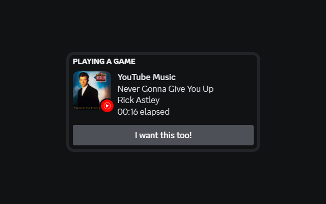

# Server installation
1) Make sure you have Node.JS installed. Download it from https://nodejs.org/
2) After installing Node.JS, download this repository.
3) Open command prompt in the folder
4) Run `npm install`
5) You can close the command prompt.
5) To start the server, click on `Start.vbs`

# Chrome extension installation
1) Visit idk
2) Install the extension

# Usage
1) Head over https://music.youtube.com/
2) Start a song and check your Discord profile :)
3) The result should look like something like that:

# Notes
- The server will automatically start itself on boot. File location: shell:startup > youtube-music-discord-rpc-server.lnk
- You obviously need the desktop app of Discord installed
- `Start.vbs` runs the server in the background. If you want to see the console, you can run `server.bat`